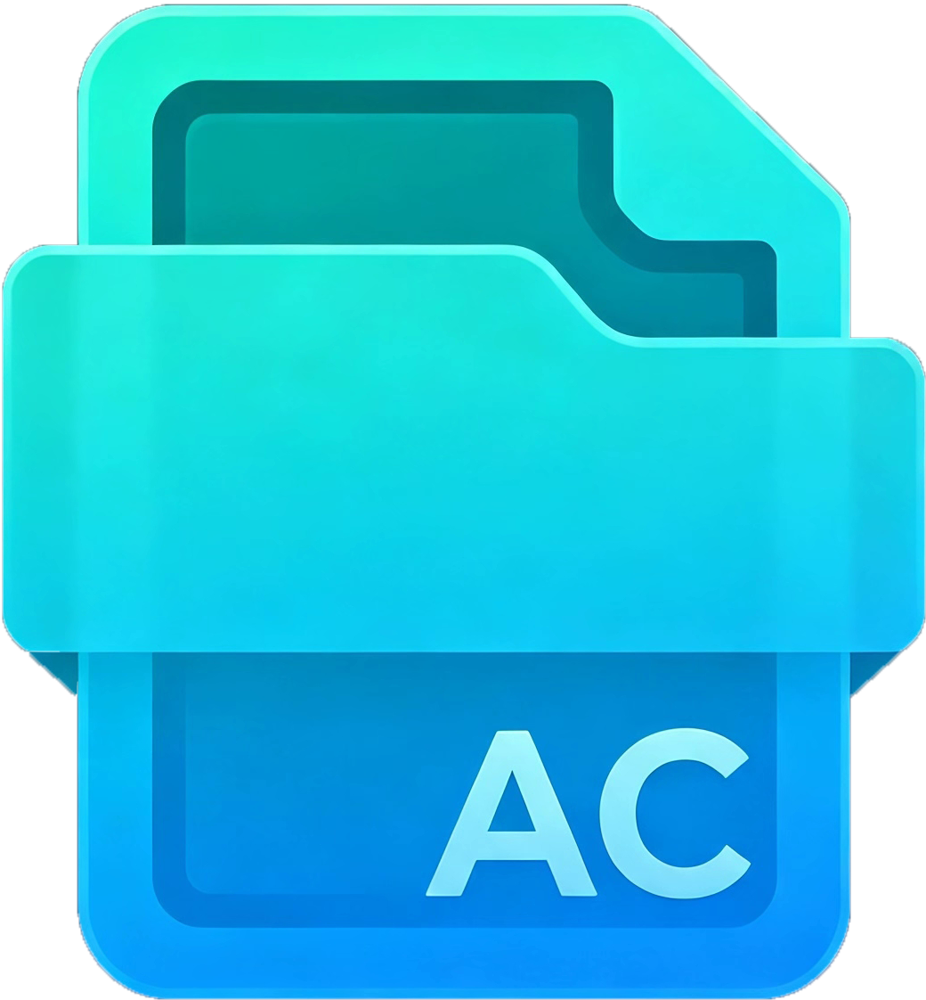

# ArchiveCleaner

<p align="center">
  
</p>

<p align="center">
  <b>压缩包清理工具 — 批量搜索、勾选、删除压缩文件</b>
</p>

<p align="center">
  
  
  
  
</p>

---

## 简介

ArchiveCleaner 是一个 Windows 桌面工具，用于扫描指定文件夹下的压缩包文件，通过复选框批量勾选后一键删除（送入回收站或永久删除）。支持多种搜索引擎，删除失败时自动检测占用进程。

### 核心特性

- 🔍 **四档搜索引擎**
  - **Everything**（默认）：秒级搜索，依赖 [Everything](https://www.voidtools.com/) 索引服务
  - **Win32 遍历**：通用兜底，零依赖
  - **fdfind**：基于 [fd](https://github.com/sharkdp/fd) 的并行遍历，无需索引
  - **MFT**：直读 NTFS 主文件表，最快（需管理员权限）
  - 引擎不可用时自动降级

- 🗑️ **安全删除**
  - 送入回收站（可恢复）或永久删除
  - 删除失败自动检测占用进程（Restart Manager API）
  - 超时保护 + COM 初始化 + RAII 守卫

- 📁 **智能扫描**
  - 自动排除回收站（`$RECYCLE.BIN`）和系统目录
  - 支持 14 种压缩格式：`.zip .rar .7z .tar .gz .bz2 .tgz .xz .iso .cab .z .lz .lzma .tbz2`
  - 路径归一化（正反斜杠混合不再导致删除失败）

- ⚡ **极致轻量**
  - 单文件 exe，约 2MB
  - 零外部 DLL 依赖（全部静态链接）
  - 基于 [EUI-NEO](https://github.com/sudoevolve/EUI-NEO) GPU 渲染框架

## 截图

> *在此处放置软件截图*

## 下载安装

### 方式一：安装包（推荐）

下载 [ArchiveCleaner-Setup-v1.0.exe](../../releases)，双击运行：
- 安装时可选择是否一并安装 Everything 搜索引擎
- 自动创建桌面快捷方式和开始菜单

### 方式二：便携版

下载 zip 压缩包，解压后双击 `ArchiveCleaner.exe` 即可运行。

## 使用方法

1. 在路径栏输入或粘贴要扫描的文件夹路径（为空时点击路径栏可弹窗选择）
2. 点击「开始扫描」
3. 勾选要删除的压缩包文件（支持全选/反选）
4. 选择删除方式（回收站 / 永久删除）
5. 点击「删除选中」并确认

## 从源码构建

### 环境要求

- Visual Studio 2022 Build Tools（MSVC v143）
- CMake 3.20+（通过 Qt 安装器获取或独立安装）
- Ninja 构建器

### 编译步骤

```bat
# 加载 MSVC 环境后
cd A:\ArchiveCleaner
build.bat
```

构建产物在 `build\ArchiveCleaner.exe`。

### 制作安装包

```bat
# 需安装 Inno Setup 6
ISCC.exe installer.iss
```

## 技术架构

```
┌─────────────────────────────────────┐
│  UI 层 (compose)                    │
│  EUI-NEO 声明式 GPU 渲染             │
├─────────────────────────────────────┤
│  Domain 层 (AppModel)               │
│  状态机 + app::async 异步编排         │
├─────────────────────────────────────┤
│  Core 层 (纯 Win32 + STL)           │
│  四档引擎 + Deleter + ProcessChecker │
└─────────────────────────────────────┘
```

- **Core 层**：纯 Win32 API + STL，零框架依赖，可独立测试
- **Domain 层**：AppModel 持有状态机和数据，通过 `app::async` 编排异步任务
- **UI 层**：极薄的 compose 函数，声明式构建界面，所有操作委托给 Domain

## 开发文档

- [架构设计](docs/ARCHITECTURE_EUI.md)
- [调研笔记（Win32 API）](docs/RESEARCH_NOTES.md)
- [依赖清单](docs/DEPENDENCIES.md)

## 致谢

- [EUI-NEO](https://github.com/sudoevolve/EUI-NEO) — 高性能 GPU UI 框架
- [Everything](https://www.voidtools.com/) — 最快的 Windows 文件搜索引擎
- [fd](https://github.com/sharkdp/fd) — 简单快速的文件查找工具

## 许可证

本项目仅供学习和个人使用。

### 第三方组件

本项目使用了以下开源组件，在此表示感谢。完整的许可证信息见 [THIRD-PARTY-LICENSES.md](THIRD-PARTY-LICENSES.md)。

- [EUI-NEO](https://github.com/sudoevolve/EUI-NEO) (Apache 2.0) — GPU UI 框架
- [GLFW](https://www.glfw.org/) (zlib) — 窗口和输入
- [FreeType](https://freetype.org/) (FTL) — 字体渲染
- [yyjson](https://github.com/ibireme/yyjson) (MIT) — JSON 解析
- [stb_image](https://github.com/nothings/stb) (Public Domain) — 图像加载
- [fd](https://github.com/sharkdp/fd) (MIT) — 文件搜索工具
- [Everything](https://www.voidtools.com/) — 文件索引服务
